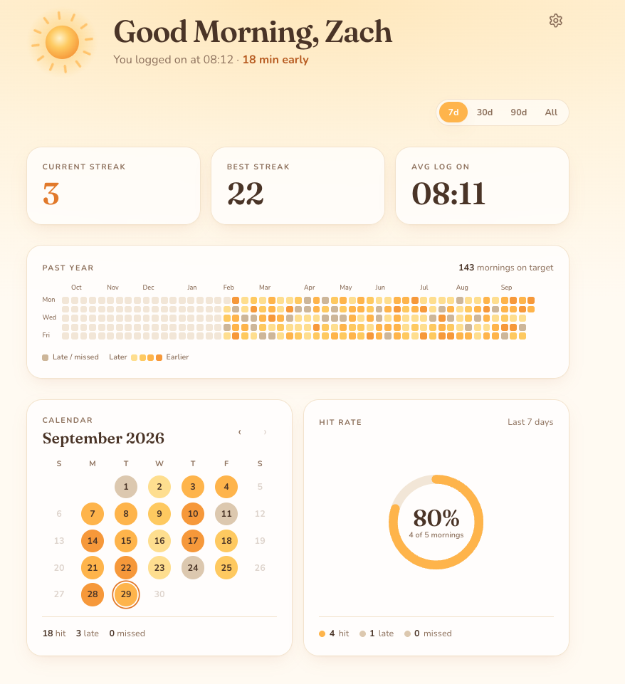

# Rise

A small personal tracker for getting to work on time. Chrome opens the site on startup, and the first visit each weekday is recorded as that morning's log-on. Rise then shows whether you hit your target time, how long your streak is, and how your mornings look over the year.

<p align="center">
  
</p>

## Features

- **Automatic log-ons:** the first time the page is seen on a weekday is recorded. Refreshes don't count again, and weekends are never tracked.
- **Hit, late or missed:** a log-on at or before the target time plus a grace period is a hit (default 8:30 AM + 15 min). Later is late, and a weekday with no log-on is missed.
- **Streaks and stats:** current and best streak, average log-on time, and hit rate over the last 7, 30 or 90 days, or all time.
- **Year heatmap and month calendar:** hit days are gold, darker the earlier you logged on. Late and missed days are a muted tan.
- **Edit past days:** click a calendar day to add, change or delete its log-on.
- **Settings:** your name for the greeting, target time, grace period, and when a new day starts (default 4 AM, so a visit just after midnight still counts as the night before). Changing them re-grades past days.
- **Backup:** export all your data as a JSON file and import it back, e.g. after clearing the browser cache.
- **A little celebration:** on a hit day the sun flares and ripples with gold light, and a new best streak gets its own moment. It plays once per day.

All data stays in your browser's `localStorage`. There's no account, server or tracking.

## Tech

React + Vite, Tailwind CSS v4, date-fns and Vitest. The charts are hand-built SVG. Deployed on Vercel, which rebuilds on every push to `main`.

## Running locally

```bash
npm install
npm run dev        # start the dev server
npm run test       # run the unit tests
npm run lint
npm run build
```

In dev, open `/?demo` to preview the app with about eight months of fake data (never saved), and add `&celebrate` to replay the hit celebration on every load.

## Using it as your startup page

1. Deploy the app (or run it locally) and copy its URL. On Vercel, use the project's production domain, not a per-deployment URL.
2. In Chrome, go to **Settings → On startup → Open a specific page or set of pages** and add the URL.

Data is stored per domain, so always use the same URL.
